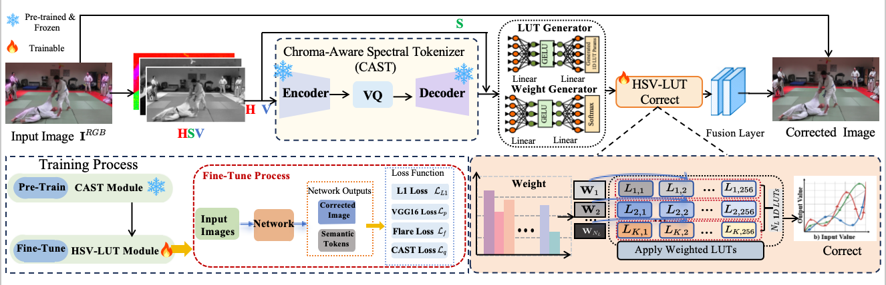
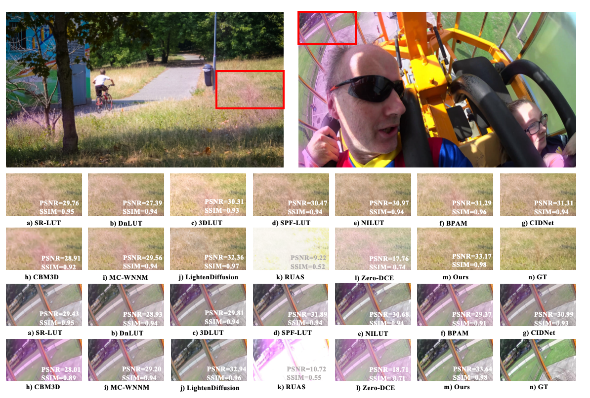

# CAST-LUT: Tokenizer-Guided HSV Look-Up Tables for Purple Flare Removal

[](https://arxiv.org/abs/XXXX.XXXXX) [](https://opensource.org/licenses/MIT)

Official PyTorch implementation for the AAAI 2026 paper: "CAST-LUT: Tokenizer-Guided HSV Look-Up Tables for Purple Flare Removal".

<p align="center">
  
</p>

## 📖 Abstract

Purple flare, a diffuse chromatic aberration artifact commonly found around highlight areas, severely degrades the tone transition and color of the image. Existing traditional methods are based on hand-crafted features, which lack flexibility and rely entirely on fixed priors,
while the scarcity of paired training data critically hampers deep learning.  To address this issue, we propose a novel network built upon decoupled HSV Look-Up Tables (LUTs). The method aims to simplify color correction by adjusting the Hue (H), Saturation (S), and Value (V) components independently. This approach resolves the inherent color coupling problems in traditional methods. Our model adopts a two-stage architecture: First, a Chroma-Aware Spectral Tokenizer (CAST) converts the input image from RGB space to HSV space and independently encodes the Hue (H) and Value (V) channels into a set of semantic tokens describing the Purple flare status; second, the HSV-LUT module takes these tokens as input and dynamically generates independent correction curves (1D-LUTs) for the three channels H, S, and V. To effectively train and validate our model, we built the first large-scale purple flare dataset with diverse scenes. We also proposed new metrics and a loss function specifically designed for this task. Extensive experiments demonstrate that our model not only significantly outperforms existing methods in visual effects but also achieves state-of-the-art performance on all quantitative metrics.

## ✨ Key Features

* **Decoupled HSV Correction**: Operates in the HSV space to perform independent 1D-LUT adjustments, avoiding color coupling issues from RGB methods.
* **Token-Guided Adaptation**: A Chroma-Aware Spectral Tokenizer (CAST) diagnoses flare characteristics into semantic tokens, which then guide the generation of adaptive correction LUTs.
* **New Dataset & Metrics**: We introduce PFSD, the first large-scale purple flare dataset, and new metrics (PSNR-F/NF, HAE) for accurate evaluation.

## 🛠️ Installation

1.  Clone the repository:
    ```bash
    git clone [https://github.com/your-username/CAST-LUT.git](https://github.com/your-username/CAST-LUT.git)
    cd CAST-LUT
    ```

2.  Install dependencies. We recommend using a virtual environment (e.g., conda or venv).
    ```bash
    pip install -r requirements.txt
    ```

    **`requirements.txt`:**
    ```
    torch
    torchvision
    kornia
    torchmetrics
    numpy
    pillow
    tqdm
    ```

## 🗂️ Repository Structure

```
CAST-LUT/
│
├── data/                    # 数据集根目录
│   ├── imagenet/            # (CAST 预训练用)
│   │   ├── train/
│   │   └── val/
│   ├── train/               # (LUT 训练用)
│   │   ├── input/
│   │   └── gt/
│   ├── val/
│   │   ├── input/
│   │   └── gt/
│   └── test/
│       ├── input/
│       └── gt/
│
├── pretrained/              # 存放预训练模型
│   └── cast_hsv_best.pth    # CAST 预训练权重
│
├── checkpoints/             # 最终模型的检查点
├── eval_results/            # 验证集的可视化结果
├── test_results/            # 最终的测试结果
│
├── model_HSV.py             # 核心模型定义 (CAST, HSV_LUT_Module)
├── castHSV_train.py         # 脚本 1: 预训练 CAST 分词器
├── train_test.py            # 脚本 2: 训练和测试完整的 CAST-LUT
├── color_utils.py           # 移动端部署
├── requirements.txt         # 依赖列表
└── README.md                # 本文件
```

## 🚀 Usage

The full process involves two stages: (1) Pre-training the CAST tokenizer, and (2) Training the final CAST-LUT network.

### Stage 1: Pre-training CAST

First, we pre-train the `CAST` module on a large-scale dataset (e.g., ImageNet) to learn a robust visual vocabulary.

```bash
python castHSV_train.py \
    --train_path ./data/imagenet/train \
    --val_path ./data/imagenet/val \
    --checkpoint_dir ./checkpoints_cast_hsv \
```

After training, copy the best model to the `pretrained` directory:

```bash
mkdir -p pretrained
cp checkpoints_cast_hsv/cast_hsv_best.pth pretrained/cast_hsv_best.pth
```

### Stage 2: Training and Testing CAST-LUT

This unified script handles both training and testing using sub-commands.

#### Training

The script will load the pre-trained CAST weights from `pretrained/cast_hsv_best.pth`, freeze them, and train the LUT generator.

```bash
python train_test.py train \
    --train_input_dir ./data/train/input \
    --train_gt_dir ./data/train/gt \
    --val_input_dir ./data/val/input \
    --val_gt_dir ./data/val/gt \
    --pretrained_cast_path ./pretrained/cast_hsv_best.pth \
    --checkpoint_dir ./checkpoints \
    --eval_output_dir ./eval_results \
    --epochs 100 \
    --batch_size 8 \
    --num_luts 16
```

#### Testing

This will load the `best_model.pth` from the `checkpoints` directory and run evaluation on the test set.

```bash
python train_test.py test \
    --test_input_dir ./data/test/input \
    --test_gt_dir ./data/test/gt \
    --checkpoint_dir ./checkpoints \
    --output_dir ./test_results \
```

## 📊 Results

Qualitative comparison with state-of-the-art methods on our PFSD dataset. Our method (CAST-LUT) successfully removes the purple flare while preserving natural colors and details.

<p align="center">
  
</p>


## 📜 Citation

If you find our work useful, please consider citing our paper:

```bibtex
@inproceedings{wang2026castlut,
  title     = {{CAST-LUT}: {T}okenizer-{G}uided {HSV} {L}ook-{U}p {T}ables for {P}urple {F}lare {R}emoval},
  author    = {Wang, Pu and Sun, Shuning and Lu, Jialang and Wu, Chen and Zhang, Zhihua and Zhang, Youshan and Shan, Chenggang and Lu, Dianjie and Zhang, Guijuan and Zheng, Zhuoran},
  booktitle = {Proceedings of the AAAI Conference on Artificial Intelligence},
  volume    = {40},
  year      = {2026}
}
```
```bibtex
Our dataset:
@misc{PuWang0_purple_flare_dataset,
  title        = {purple_flare Dataset},
  author       = {PuWang0},
  howpublished = {\url{https://huggingface.co/datasets/PuWang0/purple_flare}},
  year         = {2024} 
}
```
## 🙏 Acknowledgments

This work was supported by the National Natural Science Foundation of China Project (No. 62172265) and Shandong Provincial Natural Science Foundation (ZR2025MS1025, ZR2025MS1036).
